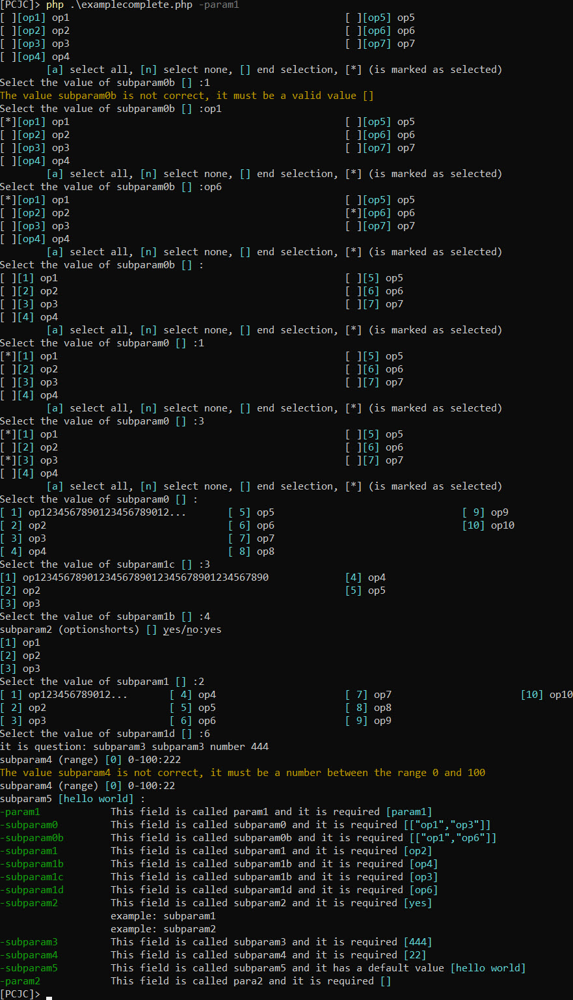
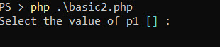
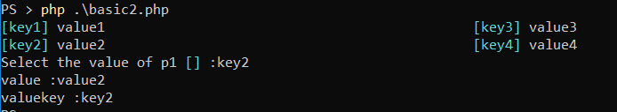
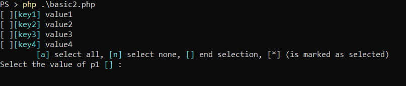
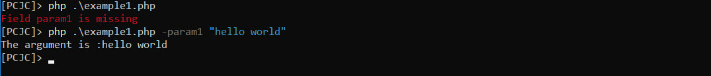
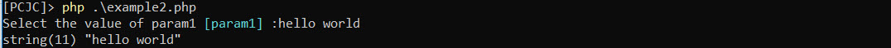
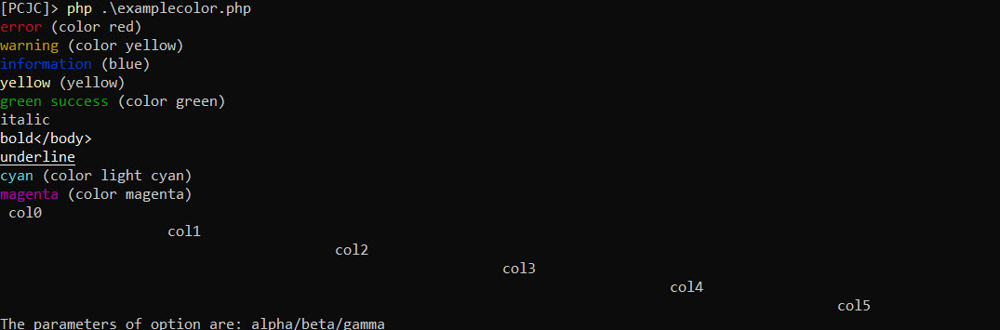
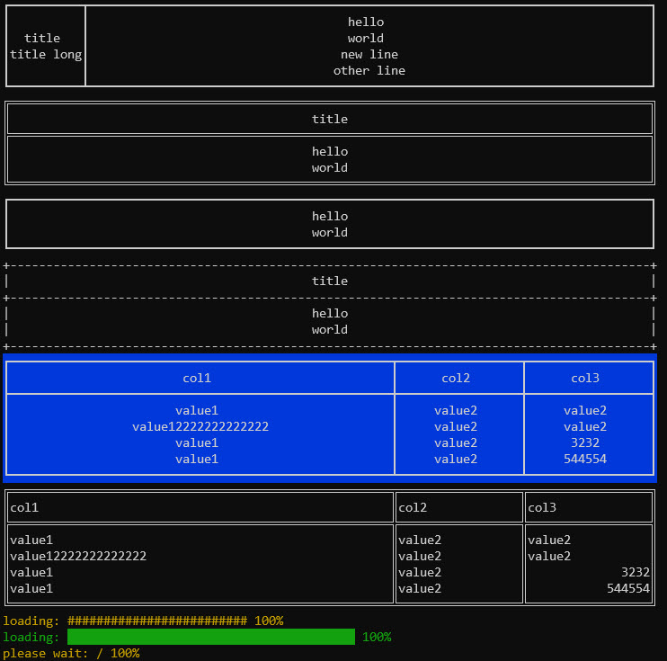

# CliOne

This library helps to create command line (CLI) operator for PHP in Windows, Mac and Linux

[](https://packagist.org/packages/eftec/CliOne)
[](https://packagist.org/packages/eftec/CliOne)
[]()
[]()
[]()
[]()
[]()

## Features

✅ Windows, Linux and Mac Compatible.

✅ This library truly minimalist and simple, it only consists of 2 classes and nothing more and no external dependency.

✅ Arguments & user input

✅ This library was aimed to (optionally) fallback to user-input if the argument is missing. 

✅ Colors available

✅ The design is mostly fluent (it adjusts to the width of the screen)

✅ Validation of values

✅ Support NO_COLOR environment variable. See https://no-color.org/





## Getting started

Add the library using composer:

> composer require eftec/clione

And create a new instance of the library

```php
$cli=new CliOne(); // instance of the library
```

## Usage

For example, let's say we need to create a CLI code to read an information and save into a file.

```shell
>php basic.php read -o result.json
```

We have two arguments, the first (read) is in the first position, and it doesn't have any "-".  The second is "-o" that it is our flag with a value.

So we could create our arguments.

```php
$cli=new CliOne();
$cli->createParam('read',[],'first')->add(); // a positional argument (the first one) value-less
$cli->createParam('o',[],'flag')->add(); // a simple flag "-o"
```

And we could evaluate as

```php
$cli->evalParam('read');
$cli->evalParam('o');
// So we could obtain our values as:
var_dump($cli->getParameter('read')->value); 
var_dump($cli->getParameter('o')->value);
// or as
var_dump($cli->getValue('read'));
var_dump($cli->getValue('o'));
```

It will return **false** if we don't set a value, and it will return the value it we set it.

```shell
>php basic.php read -o result.json
string(4) "read"
string(11) "result.json"
```

> **The parameters are created and evaluated separately because it allows to do more powerful operations with it.**
>
> For example, sometimes we want to show the help (the list of parameters available) without evaluating the parameters.

Ok, but now what if we want to create an alias of "-o"

```php
var_dump($cli->getParameter('o',['output','outputresult'])->value);
```

So we could call using this line

```shell
php basic.php read --output result.json
# or also
php basic.php read --outputresult result.json
# or also
php basic.php read -o=result.json
```

> **If the parameter is a flag, then the alias is a longflag ("--"). If the parameter is a longflag then the alias is a flag.**

But let's say we need to ask for a password, however we want to be entered interactively.

```php
$cli->createParam('pwd',[],'flag') // we create the parameter
    ->setInput(true,'password') // and we ask (if the parameter is not entered as flag) 
                                //for user input of the type password (however the password is not hidden visually)
    ->add();
$cli->evalParam('pwd');   // and don't forget to evaluate the parameter
```

So it will look like:

```shell
> php .\basic.php read -o result.json
Select the value of pwd [*****] :123
```

Now, let's say something more advanced, multiple options, we want to select the type of file: json, csv, html and xml

Our code

```php
$cli->createParam('type',[],'flag')
    ->setInput(true,'option',['json','csv','xml','html'])
    ->add();
```

And the result:

```shell
PS > php .\basic.php read -o result.json
Select the value of pwd [*****] :111
[1] json                     
[2] csv                      
[3] xml                      
[4] html                     
Select the value of type [] :2 #you could use TAB key for autocomplete, cool!
```

> **List of values are divided in two values, the visual value (simply called value), and the key-value.**. In this example, "csv" is a value and its key-value is "2".
>
> The list of values allows associative arrays and indexed arrays.  Indexed arrays are renumbered to start in 1.

You could also enter 

> php .\basic.php read -o result.json -pwd 123 -type json

Now, you can show the parameters ("show the syntax help") as follows:

```php
$cli->showParamSyntax2('parameters:');
```

But it will look plain.

It is because you can add a description, change the question and add more help information

```php
$cli->createParam('type',[],'flag')
    ->setDescription('it is the type of output','what is the option?',['it is the help1','example: -option xml'])
    ->setInput(true,'option',['json','csv','xml','html'])
    ->add();
```

So it will look like: (in colors)

```shell
parameters:
read                         The command [read]
-o, --output, --outputresult The output file without extension [result.json]
                             example: -o file
-pwd                         It is the password [*****]
-type                        it is the type of output [csv]
                             it is the help1
                             example: -option xml
```

There are more operations available but the basic is there.

# Table of contents

- [CliOne](#clione)
  - [Features](#features)
  - [Getting started](#getting-started)
  - [Usage](#usage)
  - [Types of arguments](#types-of-arguments)
  - [Flow](#flow)
  - [Examples](#examples)
    - [Example using arguments](#example-using-arguments)
    - [Example using user input](#example-using-user-input)
    - [Example with a game](#example-with-a-game)
    - [Example colors](#example-colors)
    - [Example tables](#example-tables)
  - [Types of user input](#types-of-user-input)
  - [Types of colors](#types-of-colors)
  - [Definitions](#definitions)
  - [Changelog](#changelog)

## Flow

* (optional) you can set the current value using the method setParam()
* If the type of parameter is not "onlyinput" and "none", then it reads the parameter
  * Example: php program.php -param1 value --param2 -param3="hello world" parampositional
* If the parameter is found, then it is returned, **end of the flow**.
* If the parameter is not found then
  * If setCurrentAsDefault() is set, and the current value is not null, then the default value is the current value.
  * Otherwise, the default value is the value set using the method setDefault(). If none, then it uses null.
* if input is true setInput(true) then it asks to user-input the value
  * if the user doesn't fill the information, then it returns the default value (if any), **end of the flow**
  * if the user fills the information, but it is incorrect, then it asks again and again.
  * if the user fills the right information, then it returns this value, **end of the flow**
* if input is true setInput(false) then
  * Note: we were unable to read the values of the argument, and we don't want to read from user input. 
  * it returns the default value, and it could raise an error, **end of the flow**

Note:

* isRequired() if the value is missing, then it shows an error.
* setAllowEmpty() if the value is empty (not missing), then it allows to enter an empty value


## Input as arguments

```shell
php mycli.php subcommandfirst subcommandsecond -flag valueflag --longflag valueflag2 subcommandlatest
```

The system allows reading multiple types of arguments

* **first**: this argument does not have value, and it is position (in the very first position), it could be not be prefixed with a "-"
* **command**: it is similar to **first,** but it does not compare the name of the argument.
  * cliprogram.php com -flag, first returns "com" if the argument is named first.  command returns "com" regardless of its name.
* **second**: this argument is also positional (second position) and does not have any value
* **last**: this argument is also positional, and it is always at the latest argument
* **flag**: the argument is prefixed with a single "-". This argument not need to be a single character.
* **longflag**: the argument is prefixed with a double "--"
* **onlyinput/none**: the system never read it as argument, so it could be user-input.
   * none means that the argument is only user-input, and it must not be stored. 

The argument could be created as:

```php
// program.php -f hello
// or
// program.php -f=hello
// or
// program.php -f "hello world"
$cli->createParam('f','flag')->add();  // add() is important otherwise the parameter will not be create.
```

And it could be read as:

```php
$result=$cli->evalParam('name'); // $result->value will return "hello"
```

Now, what if you want to create multiples alias for the same parameter.

```php
// program.php -h 
// or
// program.php --help 
$cli->createParam('h','flag',['help'])->add();  // it adds an alias longflag called "help"
```

## Input interactive

There are several configuration to set an input interactively.

By default, every parameter is read as argument. If the value is read as argument, then it is not asked interactively.

However, if the parameter is of the type "**none**" or "**onlyinput**", then they are only obtained by user input (interactively).

Example:

```php
$cli->$t->createParam('paramname',[],'none');
```

### User input (interactive)

With the method setInput() we set that this parameter could also be read interactively.

```php
$cli->$t->createParam('paramname',[],'none')->setInput();
```

Example, let's say the next example:

```php
$cli=new CliOne();
$cli->createParam('p1',[],'none')
    ->setInput()
    ->add(); // we create the param
$cli->evalParam('p1'); // and we evaluated the parameter
```



Now, this input accepts any kind of text. But there is many  different kind of user input.

| type        | description                                                  | argument                            | example                                                      |
| ----------- | ------------------------------------------------------------ | ----------------------------------- | ------------------------------------------------------------ |
| number      | It allows any kind of number                                 |                                     | setInput(true,"number")                                      |
| range       | it only allow number between a range of values               | [1,20]                              | setInput(true,"range",[1,10])                                |
| string      | It allows any type of value                                  | (used for auto complete)            | setInput(true,"string")                                      |
| password    | It allows any type of value but the  default value is never displayed | setInput(true,"password")           |                                                              |
| multiple    | it allows to check one or multiple values using 1 column     | ['key1'=>'value1','key2'=>'value2'] | setInput(true,"multiple",['key1'=>'value1','key2'=>'value2']) |
| multiple2   | it allows to check one or multiple values using 2 columns    | ['key1'=>'value1','key2'=>'value2'] | setInput(true,"multiple2",['key1'=>'value1','key2'=>'value2']) |
| multiple3   | it allows to check one or multiple values using 3 columns    | ['key1'=>'value1','key2'=>'value2'] | setInput(true,"multiple3",['key1'=>'value1','key2'=>'value2']) |
| multiple4   | it allows to check one or multiple values using 4 columns    | ['key1'=>'value1','key2'=>'value2'] | setInput(true,"multiple4",['key1'=>'value1','key2'=>'value2']) |
| option      | it allows to select a value from a list using 1 column       | ['key1'=>'value1','key2'=>'value2'] | setInput(true,"option",['key1'=>'value1','key2'=>'value2'])  |
| option2     | it allows to select a value from a list using 2 columns      | ['key1'=>'value1','key2'=>'value2'] | setInput(true,"option2",['key1'=>'value1','key2'=>'value2']) |
| option3     | it allows to select a value from a list using 3 columns      | ['key1'=>'value1','key2'=>'value2'] | setInput(true,"option3",['key1'=>'value1','key2'=>'value2']) |
| option4     | it allows to select a value from a list using 4 columns      | ['key1'=>'value1','key2'=>'value2'] | setInput(true,"option4",['key1'=>'value1','key2'=>'value2']) |
| optionshort | It allows a selection of values                              | ["yes","no"]                        | setInput(true,"multiple4",['key1'=>'value1','key2'=>'value2']) |

Option returns a value and a value-key.  Value is the content visible. And value-key, is the content selected by the user.

**Example Option:**

```php
$cli=new CliOne();
$cli->createParam('p1',[],'none')
    ->setInput(true,'option2',['key1'=>'value1','key2'=>'value2','key3'=>'value3','key4'=>'value4'])
    ->add(); // we create the param
$cli->evalParam('p1');
$cli->showLine("value :".$cli->getValue('p1'));
$cli->showLine("valuekey :".$cli->getValueKey('p1'));
```



**Example Multiple:**

```php
$cli=new CliOne();
$cli->createParam('p1',[],'none')
    ->setInput(true,'option2',['key1'=>'value1','key2'=>'value2','key3'=>'value3','key4'=>'value4'])
    ->add(); 
$cli->evalParam('p1'); // value returns an associative array with the values selected, example: ["value1","value3"]
```




### Customize user input

It is possible to customize the input by changing the help description, changing the question, showing an example or showing a value to the argument

```php
$cli=new CliOne();
$cli->createParam('p1',[],'none')
    ->setInput()
    ->setDescription('it is for help','what is the value of p1?',['help line1','help line 2'],'the argument is called p1')
    ->add(); 
$cli->evalParam('p1'); 
```


## Examples

### Example using arguments

[example/example1.php](example/example1.php)

And create the next code

```php
// example1.php
// don't forget to add autoloader, namespace, etc.
$cli=new CliOne(); // instance of the library
if($cli->isCli()) { // we validate if we are running a CLI or not.
  $cli->createParam('param1') // the name of the parameter
        ->setDescription('Some description','question?') // description and question
        ->setRequired(true) // if the field is required
        ->setDefault('param1') // the default value If the value is not found
        ->add(); // it adds a parameter to the cli
  $param1=$cli->evalParam('param1'); // then we evaluate the parameter.
  var_dump($param1->value);  
}
```
So you can run as:




### Example using user input

You can ask for user input of the user.

[example/example2.php](example/example2.php)

```php
$cli=new CliOne();
if($cli->isCli()) {
    $cli->createParam('param1')
        ->setDescription('This field is called param1 and it is required')
        ->setInput(true,'string')
        ->setRequired(true)
        ->setDefault('param1')
        ->add();
    $param1 = $cli->evalParam('param1');
    var_dump($param1->value);
}
```

It will show the next result




### Example with a game

[example/examplegame.php](example/examplegame.php)


Image (c) George Beker

 


### Example colors

You can see the tags available in [Types of colors](#types-of-colors)

[example/examplecolor.php](example/examplecolor.php)


```php
$cli->showLine("<bold>bold</bold>");
$cli->showLine("<dim>dim</dim>");
$cli->showLine("<bred>background red</bred>");
$cli->showLine("<bblue>background red</bblue>");
$cli->showLine("<bwhite><black>background white</black> </bwhite>");
$cli->showLine("<byellow><blue>background yellow</blue></byellow>");
$cli->showLine("<red>error</red> (color red)");
$cli->showLine("<yellow>warning</yellow> (color yellow)");
$cli->showLine("<blue>information</blue> (blue)");
$cli->showLine("<yellow>yellow</yellow> (yellow)");
$cli->showLine("<green>green</green> (color green)");
$cli->showLine("<italic>italic</italic>");
$cli->showLine("<bold>bold</bold>");
$cli->showLine("<bold><yellow>bold yellow</yellow></bold>");
$cli->showLine("<strikethrough>stike</strikethrough>");
$cli->showLine("<underline>underline</underline>");
$cli->showLine("<cyan>cyan</cyan> (color cyan)");
$cli->showLine("<magenta>magenta</magenta> (color magenta)");
$cli->showLine("<bold><cyan>bold cyan</cyan></bold> (color cyan)");
$cli->showLine("<bold><magenta>bold magenta</magenta></bold> (color magenta)");
$cli->showLine("<bblue><col0/> col0</bblue>");
$cli->showLine("<bblue><col1/> col1</bblue>");
$cli->showLine("<bblue><col2/> col2</bblue>");
$cli->showLine("<bblue><col3/> col3</bblue>");
$cli->showLine("<bblue><col4/> col4</bblue>");
$cli->showLine("<bblue><col1/> col1 <col3/> col3 <col5/> col5</bblue>");
$cli->showLine("The parameters of option are: <option/>",$cli->getParameter('test'));
```




### Example tables

[example/exampletables.php](example/exampletables.php)




## Types of user input

| userinput    | description                                                             |
|--------------|-------------------------------------------------------------------------|
| number       | the value must be a number                                              |
| range        | the value must be a number between a range of values                    |
| string       | the value must be a string (by default, nulls are not string)           |
| password     | the value must be a string (and if it is displayed, then it shows ****) |
| multiple     | It allows to select one or many values displated in 1 column            |
| multiple2    | The same than multiple but displayed in 2 columns                       |
| multiple3    | The same than multiple but displayed in 3 columns                       |
| multiple4    | The same than multiple but displayed in 4 columns                       |
| option       | It allows to select one from many values displayed in a column          |
| option2      | The same than option but displayed in 2 columns                         |
| option3      | The same than option but displayed in 3 columns                         |
| option4      | The same than option but displayed in 4 columns                         |
| optionsimple | It allows to select one from many values. It doesn't use columns        |

## Types of colors

| tag                                        | description                   |
|--------------------------------------------|-------------------------------|
| <red>error</red>                           | color red                     |
| <yellow>warning</yellow>                   | color yellow                  |
| <blue>information</blue>                   | blue                          |
| <black>black</black>                       | black                         |
| <white>white</white>                       | white                         |
| <green>success</green>                     | color green                   |
| <italic>italic</italic>                    | italic                        |
| <bold>bold</body>                          | bold                          |
| <underline>underline</underline>           | underline                     |
| <cyan>cyan</cyan>                          | color light cyan              |
| <magenta>magenta</magenta>                 | color magenta                 |
| <col0/><col1/><col2/><col3/><col4/><col5/> | col0 leftmost column          |
| <option/>                                  | if the input has some options |
| <bred>red</bred>                           | background color red          |
| <byellow><bblue>..                         | background color              |

## Definitions

You can find the definition of the classes, methods and fields at:

[definitions.md](definitions.md)

## Compatibility

* It must support all moderns interface that are compatibles with Virtual Terminal.
* Since Windows TH2 (v1511, 2015), cmd.exe and powershell.exe has supports or VT, but it must be enabled.
  * REG ADD HKCU\CONSOLE /f /v VirtualTerminalLevel /t REG_DWORD /d 1
* Since Windows 10 Anniversary Edition (v1607, 2016), cmd.exe and powershell.exe has default supports of VT (AFAIK)
* Windows 2019 (LTS, 2018) supports this library by default.
* Windows Terminal supports all features.
* The screen size width is -1 column less in older version of Windows.  C'mon, Microsoft!

## Changelog
* 1.19   (2022-06-18)
  * Update the creation of table 
* 1.18.1 (2022-06-17)
  * Fixed a bug when we use setCurrentAsDefault() but the type of value is an option (we set the default the valuekey instead of the value) 
* 1.18 (2022-06-11)
  * Added the method addExtensionFile()
* 1.17 (2022-06-09)
  * fixed many problems with Linux (number of rows, autocomplete, etc.)
* 1.16 (2022-03-25)
  * setParam() allows to set the value or the value-key    
* 1.15 (2022-03-15)
  * showHelp() shows more information.
  * colorText() now correct some missing tags.
* 1.14 (2022-03-04)
  * method showTable() allows to show or hide the top, sides and bottom borders. 
* 1.13 (2022-02-28)
  * Changed silentError to errorType 
* 1.12 (2022-02-26)
  * CliOne:
    * added a memory stream
    * set the default stream
    * set the current stream to use stdout,stderr or memory (stdin is not used for in)
    * added a new parameter type "command" that it is equals than first, but it ignores the name and considers the position.
    * added the method showHelp()
    * added the method makeBigWords()
    * added fontZnaki()
    * added fontaatr()
      * both fonts use a lot of space in code, but they are only an array of bits, so they use only 2KB.
    * new method alignLinesVertically()
    * new method maxWidth()
    * renamed field cmdMode to noANSI
    * method initialEndStyle()
  * CliOneParam:
    * Added a field related.
* 1.11 (2022-02-22)
  * Added supports for STDIN, STDOUT, and STDERR. 
* 1.10 (2022-02-21)
  * **[new]** support for the old command line (cmd.exe). It is activated automatically.
    * It degraded the colors to b&w and changes the utf-8 characters to be compatible.
    * Also, the scroll bar and the waiting cursor is not displayed in this mode. 
    * See compatibility for more information.

* 1.9 (2022-02-20)
  * **[new]** argumentIsValueKey and memory 
  * **[changed]** **Changed the signature of createParam(), switched the second and third argument**
* 1.8 (2022-02-20)
  * **[new]** setParam() throw an exception if the parameter is not defined.
  * **[new]** showParamSyntax2()
  * **[new]** CliOneParam::$nameArg name of the argument (used in help)
* 1.7 (2022-02-18)
  * **[fix]** added type hinting for most fields and methods. 
  * **[new]** new setValue() for CliOneParam.
* 1.6.1 (2022-02-18)
  * **[fix]** fixed a small bug with the value is set manually, so it is still marked as missing. 
* 1.6 (2022-02-18)
  * **[new]** new method isParameterPresent() 
* 1.5.5 (2022-02-18)
  * getParameter() always returns a parameter, no matter if it does not exist.
    * You can use the method isValid() to check its validity  
  * setSilentError() you can silent the error output.
  * addhistory() renamed as setAddHistory()
  * To add a new parameter add() validates if the key is already in use, if the key is an alias of other, or if the alias is in use.
* 1.5.4 (2022-02-18)
  * fixed a problem with the default value.
  * added history (if available)
* 1.5.3 (2022-02-18)
  * nothing, just a renumeration
* 1.5.2 (2022-02-18)
  * **[fix]** some cleanups of the code.
* 1.5.1 (2022-02-18)
  * **[fix]** fixed a problem when the type is "none", it returned null instead of false.
  * **[new]** CliOneParam::evalParam() could return the value instead of the instance.
* 1.5 (2022-02-17)
  * **[fix]** corrected the display and trim of some text when the text uses a color.
  * **[new]** it allows multiples types of arguments (not only flags), including positional, flags, long-flags are none.
  * **[new]** added stack. Some visual elements allows to stack values.
* 1.4.1 (2022-02-15)
  * **[fix]** some fix for characters thare unicode. The system will use automatically MB_STRING if the library is available.
  Otherwise, it will use the default library 
  * **[new]** new styles and patterns for components.
* 1.4 (2022-02-15)
  * **[replaced]** now all colors are express not abbreviated "<e>" => "<red>", etc.
  * **[new]** added all basic colors, background and solved a problem with the underline.
  * **[new]** added showFrame(),showTable(),showWaitCursor(),showProgressBar()
* 1.3 (2022-02-14)
  * **[new]** added autocomplete (tab key)
  * **[new]** added breadcrub
  * **[new]** added showValuesColumn()
  * **[replaced]** now keys (showing in options) are aligned at the center.
* 1.2.2 (2022-02-14)
  * **[fixed]** fixed a problem where the question is truncated with an ellipsis (...)
* 1.2.1 (2022-02-13)
  * **[fixed]** fixed some bugs
  * **[new]** keys are padded, example [ 1] [ 2] [ 3] ... [99],  [value 1] [value 2] [value  ]
* 1.2 (2022-02-13)
  * **[replaced]** "options" renamed as "multiple". Added "multiple2","multiple3","multiple4"
  * **[new]** associative arrays are allowed.
  * **[new]** added templates.
  * **[new]** added valuekey.
* 1.1 (2022-02-12)
  * **[new]** new methods savedata(),getArrayParams(),setArrayParam(),readData()
  * **[replaced]** a new argument for the method replaceColor()
  * **[new]** a new type called password
* 1.0.1 (2022-02-11)
  * **[Fixed]** namespace.
  * **[Fixed]** replaceColor() fixed a color
  * **[Added]** CliOne::indVendorPath()
* 1.0 (2022-02-11)
  * End of beta, first release. 
* 0.7 (2022-02-11)
  * Added option4.
  * optionshorts allows to specify the first letter, only if the first letter is unique, examples: yes/no allows to use y/n
* 0.6 (2022-02-11)
  * Added option2 and option3 
  * allowNulls() now doesn't work with default values.
* 0.5 (2022-02-03) 
  * [unittest] Better unit test.
  * [CliOneParam] You can set if you allow empty values or not.
  * [CliOne] You can set if you allow empty values or not.
* 0.4 (2022-01-27) Now test coverage is over the 75%
* 0.3 (2022-01-26) new corrections to the reading of values
* 0.2 some updates
* 0.1 first version
