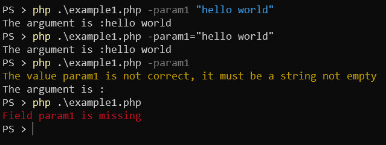
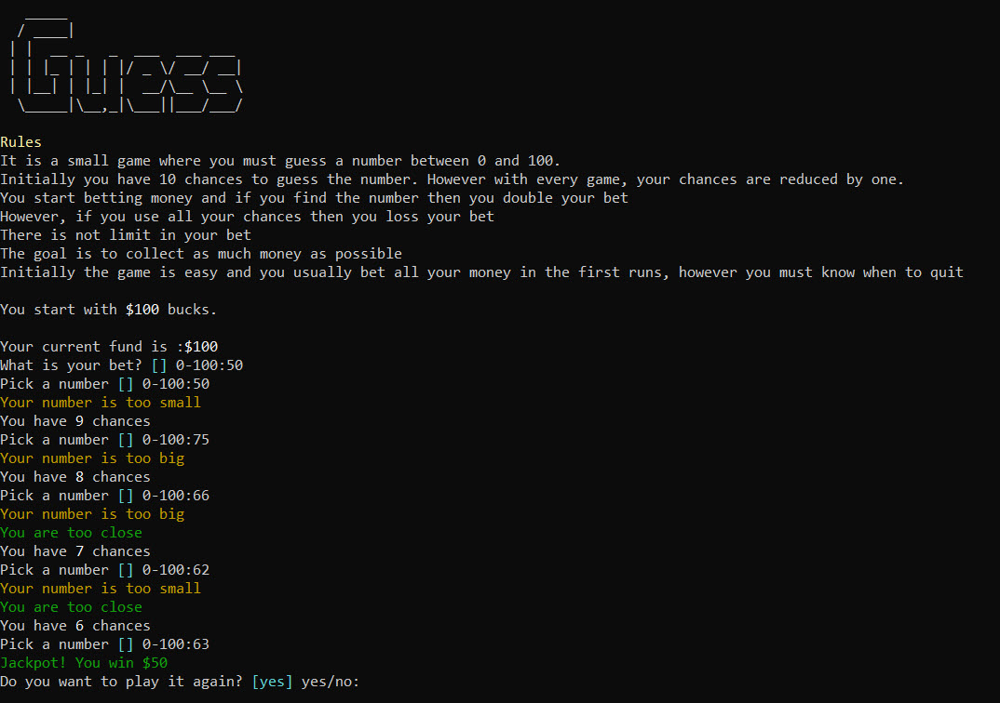
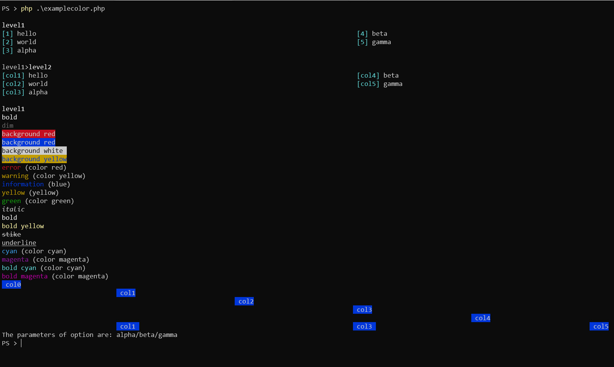

# CliOne

This library helps to create command line (CLI) operator for PHP in Windows, Mac and Linux

[](https://packagist.org/packages/eftec/CliOne)
[](https://packagist.org/packages/eftec/CliOne)
[]()
[]()
[]()
[]()
[]()

## Features

✅ Windows, Linux and Mac Compatible.

✅ This library is simple, it only consists of 2 classes and nothing more and no external dependency.

✅ Arguments & user input

✅ Colors available

✅ Validation of values


# Table of contents

- [CliOne](#clione)
  - [Features](#features)
  - [Getting started](#getting-started)
  - [Example using arguments](#example-using-arguments)
  - [Example using user input](#example-using-user-input)
  - [Showing colors](#showing-colors)
  - [Reading arguments](#reading-arguments)
  - [Types of user input](#types-of-user-input)
  - [Types of colors](#types-of-colors)
  - [Methods CliOne](#methods-clione)
    - [Method __construct()](#method-__construct)
    - [Method findVendorPath()](#method-findvendorpath)
    - [Method getColSize()](#method-getcolsize)
    - [Method evalParam()](#method-evalparam)
    - [Method readParameterCli()](#method-readparametercli)
    - [Method show()](#method-show)
    - [Method showLine()](#method-showline)
    - [Method showParamSyntax()](#method-showparamsyntax)
    - [Method getParameter()](#method-getparameter)
    - [Method setParam()](#method-setparam)
    - [Method showCheck()](#method-showcheck)
    - [Method getValue()](#method-getvalue)
    - [Method getValueKey()](#method-getvaluekey)
    - [Method showparams()](#method-showparams)
    - [Method isCli()](#method-iscli)
    - [Method saveData()](#method-savedata)
    - [Method getArrayParams()](#method-getarrayparams)
    - [Method setArrayParam()](#method-setarrayparam)
    - [Method readData()](#method-readdata)
    - [Method createParam()](#method-createparam)
  - [Methods CliOneParam](#methods-clioneparam)
    - [Method getHelpSyntax()](#method-gethelpsyntax)
    - [Method setHelpSyntax()](#method-sethelpsyntax)
    - [Method setPattern()](#method-setpattern)
    - [Method getPatterColumns()](#method-getpattercolumns)
    - [Method resetInput()](#method-resetinput)
    - [Method __construct()](#method-__construct)
    - [Method setDefault()](#method-setdefault)
    - [Method setCurrentAsDefault()](#method-setcurrentasdefault)
    - [Method setAllowEmpty()](#method-setallowempty)
    - [Method setDescription()](#method-setdescription)
    - [Method setRequired()](#method-setrequired)
    - [Method setInput()](#method-setinput)
    - [Method evalParam()](#method-evalparam)
    - [Method add()](#method-add)
  - [Changelog](#changelog)


## Getting started

Add the library using composer:

> composer require eftec/clione

And create a new instance of the library

```php
$cli=new CliOne(); // instance of the library
```


## Example using arguments

[example/example1.php](example/example1.php)

And create the next code

```php
// example1.php
// don't forget to add autoloader, namespace, etc.
$cli=new CliOne(); // instance of the library
if($cli->isCli()) { // we validate if we are running a CLI or not.
  $cli->createParam('param1') // the name of the parameter
        ->setDescription('Some description','question?') // description and question
        ->setRequired(true) // if the field is required
        ->setDefault('param1') // the default value If the value is not found
        ->add(); // it adds a parameter to the cli
  $param1=$cli->evalParam('param1'); // then we evaluate the parameter.
  var_dump($param1->value);  
}
```
So you can run as:




## Example using user input

You can ask for user input of the user.

[example/example2.php](example/example2.php)

```php
$cli=new CliOne();
if($cli->isCli()) {
    $cli->createParam('param1')
        ->setDescription('This field is called param1 and it is required')
        ->setInput(true,'string')
        ->setRequired(true)
        ->setDefault('param1')
        ->add();
    $param1 = $cli->evalParam('param1');
    var_dump($param1->value);
}
```

It will show the next result


## Example with a game

[example/examplegame.php](example/examplegame.php)


Image (c) George Beker

 

## Showing colors

You can see the tags available in [Types of colors](#types-of-colors)

[example/examplecolor.php](example/examplecolor.php)

```php
$cli->showLine("<e>error</e> (color red)");
$cli->showLine("<w>warning</w> (color yellow)");
$cli->showLine("<i>information</i> (blue)");
$cli->showLine("<y>yellow</y> (yellow)");
$cli->showLine("<g>green</g> <s>success</s> (color green)");
$cli->showLine("<italic>italic</italic>");
$cli->showLine("<bold>bold</body>");
$cli->showLine("<underline>underline</underline>");
$cli->showLine("<c>cyan</c> (color light cyan)");
$cli->showLine("<m>magenta</m> (color magenta)");
$cli->showLine("<col0/> col0");
$cli->showLine("<col1/> col1");
$cli->showLine("<col2/> col2");
$cli->showLine("<col3/> col3");
$cli->showLine("<col4/> col4");
$cli->showLine("<col1/> col1 <col3/> col3 <col5/> col5");
$cli->showLine("The parameters of option are: <option/>",$cli->getParameter('test'));
```



## Reading arguments 

The arguments are always expressed with a symbol "-" followed by the name and value of the argument.


```php
$cli=new CliOne(); // we create an instance
if($cli->isCli()) { // is running under cli? (if not then we do nothing)
    $cli->createParam('param1') // we create a parameter called "param1"
        ->setDescription('This field is called param1 and it is required') // we add a description
        ->setRequired(true) // the mark the value as required
        ->add(); // and finally we add the argument
    $param1 = $cli->evalParam('param1'); // then we evaluated the argument previously created
    if(!$param1->missing) { // is the argument missing?
        echo "The argument is :" . $param1->value; // we show the value of the argument
    }
}
```


## Types of user input

| userinput    | description                                                  |
| ------------ | ------------------------------------------------------------ |
| number       | the value must be a number                                   |
| range        | the value must be a number between a range of values         |
| string       | the value must be a string (by default, nulls are not string) |
| password     | the value must be a string (and if it is displayed, then it shows ****) |
| multiple     | It allows to select one or many values displated in 1 column |
| multiple2    | The same than multiple but displayed in 2 columns            |
| multiple3    | The same than multiple but displayed in 3 columns            |
| multiple4    | The same than multiple but displayed in 4 columns            |
| option       | It allows to select one from many values displayed in a column |
| option2      | The same than option but displayed in 2 columns              |
| option3      | The same than option but displayed in 3 columns              |
| option4      | The same than option but displayed in 4 columns              |
| optionsimple | It allows to select one from many values. It doesn't use columns |

## Types of colors

| tag                                        | description                   |
| ------------------------------------------ | ----------------------------- |
| <e>error</e>                               | color red                     |
| <w>warning</w>                             | color yellow                  |
| <i>information</i>                         | blue                          |
| <y>yellow</y>                              | yellow                        |
| <g>green</g>                               | color green                   |
| <s>success</s>                             | color green                   |
| <italic>italic</italic>                    | italic                        |
| <bold>bold</body>                          | bold                          |
| <underline>underline</underline>           | underline                     |
| <c>cyan</c>                                | color light cyan              |
| <m>magenta</m>                             | color magenta                 |
| <col0/><col1/><col2/><col3/><col4/><col5/> | col0 left column              |
| <option/>                                  | if the input has some options |


## Methods CliOne

### Method __construct()
The constructor
#### Parameters:
* **$origin** you can specify the origin file. If you specific the origin file, then isCli will only
return true if the file is called directly. (?string)

### Method findVendorPath()
It finds the vendor path starting from a route. The route must be inside the application path.
#### Parameters:
* **$initPath** the initial path, example __DIR__, getcwd(), 'folder1/folder2'. If null, then __DIR__ (string)

### Method getColSize()
It returns the number of columns present in the screen. The columns are calculated in the constructor.

### Method evalParam()
It evaluates the parameters obtained from the syntax of the command.<br>
The parameters must be defined before call this method<br>
<b>Example:</b><br>
<pre>
// shell:
php mycode.php -argument1 hello -argument2 world
// php code:
$t=new CliOne('mycode.php');
$t->createParam('argument1')->add();
$result=$t->evalParam('argument1'); // an object ClieOneParam where value is "hello"
</pre>
#### Parameters:
* **$key** the key to read.<br>
If $key='*' then it reads all the first keys and returns the first key
found if it has a value. (string)

### Method readParameterCli()

#### Parameters:
* **$parameter** param CliOneParam $parameter (CliOneParam)

### Method show()
It's similar to showLine, but it keeps in the current line.
#### Parameters:
* **$content** param string $content (string)

### Method showLine()
It shows (echo) a colored line. The syntax of the color is similar to html as follows:<br>
<pre>
<e>error</e> (color red)
<w>warning</w> (color yellow)
<i>information</i> (blue)
<y>yellow</y> (yellow)
<g>green</g> <s>success</s> (color green)
<italic>italic</italic>
<bold>bold</body>
<underline>underline</underline>
<c>cyan</c> (color light cyan)
<m>magenta</m> (color magenta)
<col0/><col1/><col2/><col3/><col4/><col5/>  columns. col0=0 (left),col1--col5 every column of the page.
<option/> it shows all the options available (if the input has some options)
</pre>
#### Parameters:
* **$content** content to display (string)

### Method showParamSyntax()
It shows the syntax of a parameter.
#### Parameters:
* **$key** the key to show. "*" means all keys. (string)
* **$tab** the first separation. Values are between 0 and 5. (int)
* **$tab2** the second separation. Values are between 0 and 5. (int)

### Method getParameter()
It gets the parameter by the key or false if not found.
#### Parameters:
* **$key** the key of the parameter (string)

### Method setParam()
It sets the value of a parameter manually.<br>
Once the value its set, then the system skip to read the values from the command line or ask for an input.
#### Parameters:
* **$key** the key of the parameter (string)
* **$value** the value to assign. (mixed)

### Method showCheck()
It shows a label messages in a single line, example: <color>[ERROR]</color> Error message
#### Parameters:
* **$label** param string $label (string)
* **$color** =['e','i','w','g','c'][$i] (string)
* **$content** param string $content (string)

### Method getValue()
It reads a value of a parameter.
<b>Example:</b><bt>
<pre>
// [1] option1
// [2] option2
// select a value [] 2
$v=$this->getValueKey('idparam'); // it will return "option2".
</pre>
#### Parameters:
* **$key** the key of the parameter to read the value (string)

### Method getValueKey()
It reads the value-key of a parameter selected. It is useful for a list of elements.<br>
<b>Example:</b><br>
<pre>
// [1] option1
// [2] option2
// select a value [] 2
$v=$this->getValueKey('idparam'); // it will return 2 instead of "option2"
</pre>
#### Parameters:
* **$key** the key of the parameter to read the value-key (string)

### Method showparams()
It will show all the parameters by showing the key, the default value and the value<br>
It is used for debug and testing.

### Method isCli()
It will return true if the PHP is running on CLI<br>
If the constructor specified a file, then it is also used for validation.
<b>Example:</b><br>
<pre>
// page.php:
$inst=new CliOne('page.php'); // this security avoid to call the cli when this file is called by others.
if($inst->isCli()) {
echo "Is CLI and the current page is page.php";
}
</pre>

### Method saveData()
It saves information into a file. The content will be serialized.
#### Parameters:
* **$filename** the filename (without extension) to where the value will be saved. (string)
* **$content** The content to save. It will be serialized. (mixed)

### Method getArrayParams()
It returns an associative array with all the parameters of the form [key=>value]
#### Parameters:
* **$excludeKeys** you can add a key that you want to exclude. (array)

### Method setArrayParam()
It sets the parameters using an array of the form [key=>value]<br>
It also marks the parameters as missing=false
#### Parameters:
* **$array** the associative array to use to set the parameters. (array)
* **$excludeKeys** you can add a key that you want to exclude. (array)

### Method readData()
It reads information from a file. The information will be de-serialized.
#### Parameters:
* **$filename** the filename with or without extension. (string)

### Method createParam()
It creates a new parameter to be read from the command line or to be input by the user.
#### Parameters:
* **$key** The key or the parameter. It must be unique. (string)
* **$isOperator** param bool $isOperator (bool)

## Methods CliOneParam

### Method getHelpSyntax()
It returns the syntax of the help.

### Method setHelpSyntax()
It sets the syntax of help.
#### Parameters:
* **$helpSyntax** param array $helpSyntax (array)

### Method setPattern()
It sets the visual pattern<br>
<ul>
<li><b>{selection}</b> (for table) used by "multiple", it shows if the value is selected or not</li>
<li><b>{key}</b> (for table)it shows the current key</li>
<li><b>{value}</b> (for table)it shows the current value. If the value is an array then it is "json"</li>
<li><b>{valueinit}</b> (for table)if the value is an array then it shows the first value</li>
<li><b>{valuenext}</b> (for table)if the value is an array then it shows the next value (it could be the same,
the second or the last one)</li>
<li><b>{valueend}</b> (for table)if the value is an array then it shows the last value</li>
<li><b>{desc}</b> it shows the description</li>
<li><b>{def}</b> it shows the default value</li>
<li><b>{prefix}</b> it shows a prefix</li>
</ul>
<b>Example:</b><br>
<pre>
$this->setPattern('<c>[{key}]</c> {value}','{desc} <c>[{def}]</c> {prefix}:','it is the footer');
</pre>
#### Parameters:
* **$patterColumns** if null then it will use the default value. (?string)
* **$patterQuestion** the pattern of the question. (?string)
* **$footer** the footer line (if any) (?string)

### Method getPatterColumns()
It gets the pattern, patternquestion and footer

### Method resetInput()
It resets the user input and marks the value as missing.

### Method __construct()
The constructor. It is used internally
#### Parameters:
* **$parent** param CliOne $parent (CliOne)
* **$key** param ?string $key (?string)
* **$isOperator** param bool $isOperator (bool)

### Method setDefault()
It sets the default value that it is used when the user doesn't input the value<br>
Setting a default value could bypass the option isRequired()
#### Parameters:
* **$default** param mixed $default (mixed)

### Method setCurrentAsDefault()
if true then it set the current value as the default value but only if the value is not missing.<br>
The default value is assigned every time evalParam() is called.
#### Parameters:
* **$currentAsDefault** param bool $currentAsDefault (bool)

### Method setAllowEmpty()
It sets to allow empty values.<br>
If true, and the user inputs nothing, then the default value is never used (unless it is an option), and it
returns an empty "".<br> If false, and the user inputs nothing, then the default value is used.<br>
<b>Note</b>: If you are using an option, you are set a default value, and you enter nothing, then the default
value is still used.
#### Parameters:
* **$allowEmpty** param bool $allowEmpty (bool)

### Method setDescription()
It sets the description
#### Parameters:
* **$description** the initial description (used when we show the syntax) (string)
* **$question** The question, it is used in the user input. (null|string)
* **$helpSyntax** It adds one or multiple lines of help syntax. (string[])

### Method setRequired()
It marks the value as required<br>
The value could be ignored if it used together with setDefault()
#### Parameters:
* **$required** param boolean $required (boolean)

### Method setInput()
It sets the input type
#### Parameters:
* **$input** if true, then the value could be input via user. If false, the value could only be
entered as argument. (bool)
* **$inputType** =['number','range','string','password','multiple','multiple2','multiple3','multiple4','option','option2','option3','option4','optionsimple'][$i] (string)
* **$inputValue** param mixed $inputValue (mixed)

### Method evalParam()
It creates an argument and eval the parameter.<br>
It is a macro of add() and CliOne::evalParam()
#### Parameters:
* **$forceInput** if false and the value is already digited, then it is not input anymore (bool)

### Method add()
It adds an argument but it is not evaluated.
#### Parameters:
* **$override** if false (default) and the argument exists, then it trigger an exception.<br>
if true and the argument exists, then it is replaced. (bool)


## Changelog
* 1.2.1 (2022-02-13)
  * **[fixed]** fixed some bugs
  * **[new]** keys are padded, example [ 1] [ 2] [ 3] ... [99],  [value 1] [value 2] [value  ]
* 1.2 (2022-02-13)
  * **[replaced]** "options" renamed as "multiple". Added "multiple2","multiple3","multiple4"
  * **[new]** associative arrays are allowed.
  * **[new]** added templates.
  * **[new]** added valuekey.
* 1.1 (2022-02-12)
  * **[new]** new methods savedata(),getArrayParams(),setArrayParam(),readData()
  * **[replaced]** a new argument for the method replaceColor()
  * **[new]** a new type called password
* 1.0.1 (2022-02-11)
  * **[Fixed]** namespace.
  * **[Fixed]** replaceColor() fixed a color
  * **[Added]** CliOne::indVendorPath()
* 1.0 (2022-02-11)
  * End of beta, first release. 
* 0.7 (2022-02-11)
  * Added option4.
  * optionshorts allows to specify the first letter, only if the first letter is unique, examples: yes/no allows to use y/n
* 0.6 (2022-02-11)
  * Added option2 and option3 
  * allowNulls() now doesn't work with default values.
* 0.5 (2022-02-03) 
  * [unittest] Better unit test.
  * [CliOneParam] You can set if you allow empty values or not.
  * [CliOne] You can set if you allow empty values or not.
* 0.4 (2022-01-27) Now test coverage is over the 75%
* 0.3 (2022-01-26) new corrections to the reading of values
* 0.2 some updates
* 0.1 first version
